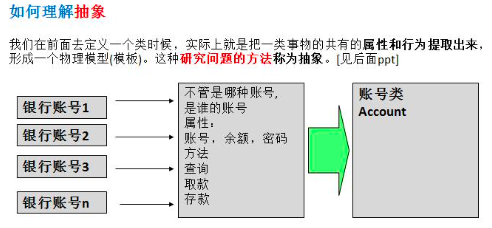
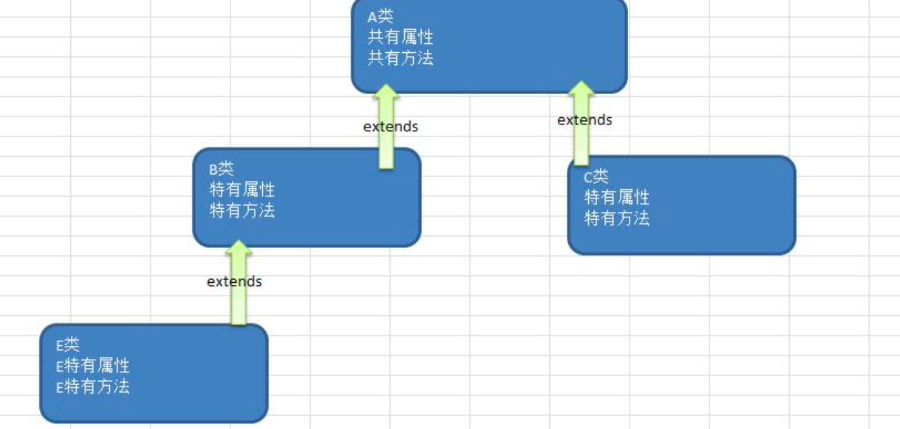
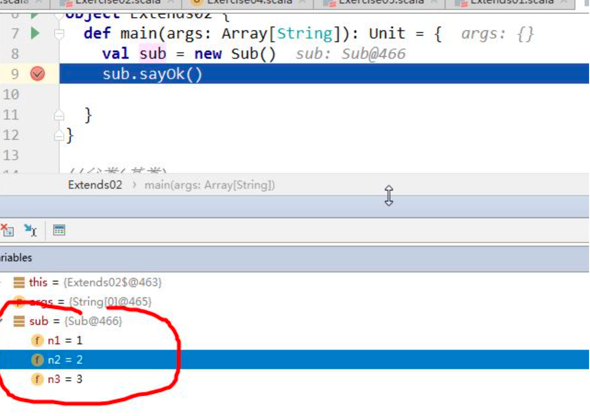
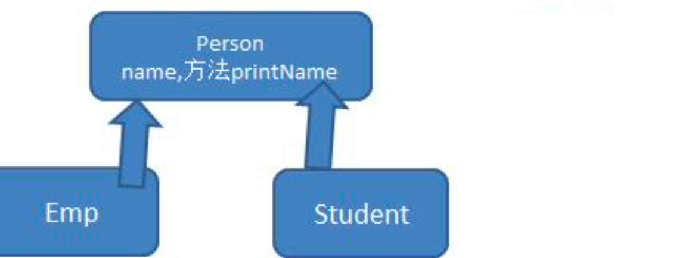
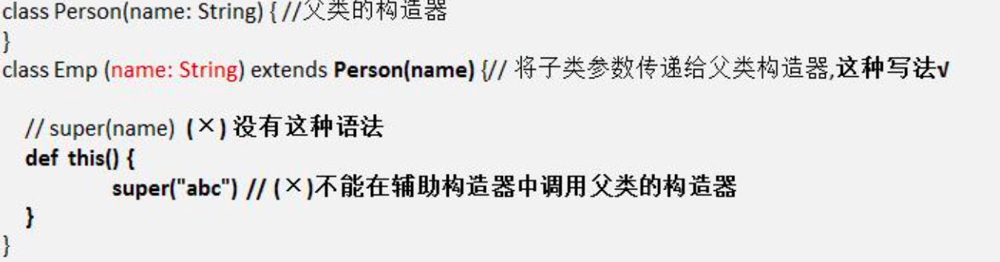
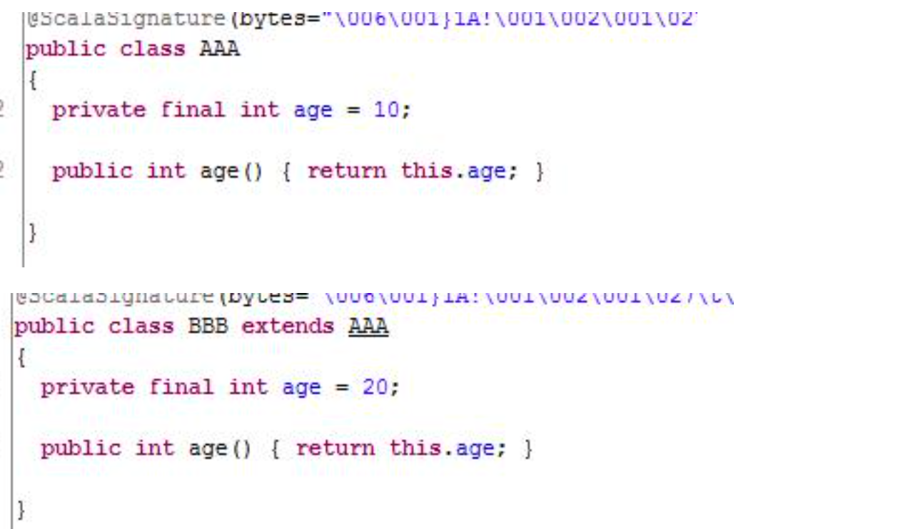
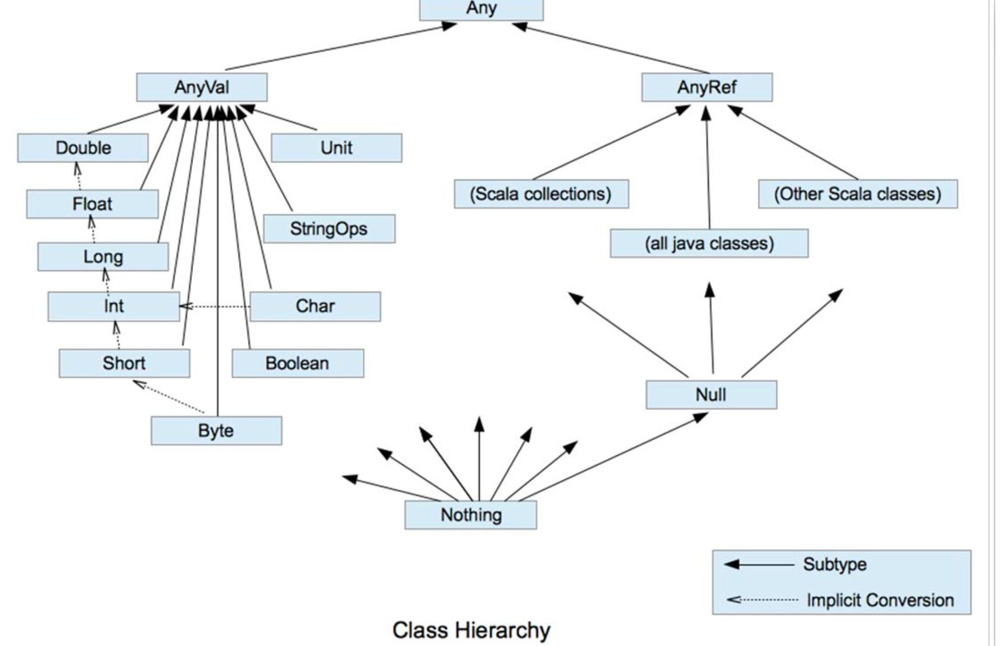

# 面向对象编程(中级部分)

## 7.1 包
### 7.1.1 看一个应用场景
现在有两个程序员共同开发一个项目,程序员 xiaoming 希望定义一个类取名 Dog ,程序员 xiaoqiang 也想定义一个类也叫 Dog。两个程序员为此还吵了起来,怎么办? ==》使用包即可以解决这个问题.

### 7.1.2回顾-Java 包的三大作用
1) 区分相同名字的类
2) 当类很多时,可以很好的管理类 
3) 控制访问范围

### 7.1.3回顾-Java 打包命令
1. 打包基本语法
   package com.bh; 
2. 打包的本质分析
    实际上就是创建不同的文件夹来保存类文件，画出示意图。

## 7.4 面向对象编程方法-抽象


## 7.5 面向对象编程三大特征

### 7.5.1 基本介绍

面向对象编程有三大特征:封装、继承和多态。

### 7.5.2 封装介绍

封装(encapsulation)就是把抽象出的数据和对数据的操作封装在一起,数据被保护在内部,程序的其,它部分只有通过被授权的操作(成员方法),才能对数据进行操作。


### 7.5.3 封装的理解和好处

1. 隐藏实现细节
2. 提可以对数据进行验证，保证安全合理
3. 同时可以加入业务逻辑


### 7.5.4 如何体现封装

1. 对类中的属性进行封装
2. 通过成员方法，包实现封装


### 7.5.5 封装的实现步骤

1. 将属性进行私有化

2. 提供一个公共的 **set** 方法，用于对属性判断并赋值

   ```scala
   def setXxx(参数名 : 类型) : Unit = { //加入数据验证的业务逻辑
   属性 = 参数名
   }
   ```

3. 提供一个公共的 get 方法，用于获取属性的值

   ```scala
   def getXxx() [: 返回类型] = {
   return 属性 }
   ```


### 7.5.6 快速入门案例

那么在 Scala 中如何实现这种类似的控制呢?

请大家看一个小程序(TestEncap.scala),不能随便查看人的年龄,工资等隐私，并对输入的年龄进行合

理的验证[要求 1-120 之间]。


### 7.5.7scala 封装的注意事项的小结

 Scala 封装还有哪些特点:

1. Scala中为了简化代码的开发，当声明属性`var`时，本身就自动提供了对应`setter/getter`方法，如 果属性声明为 private 的，那么自动生成的 setter/getter 方法也是 private 的，如果属性省略访问权限修饰 符，那么自动生成的 setter/getter 方法是 public 的[案例+反编译+说明]
2. 因此我们如果只是对一个属性进行简单的 set 和 get ，只要声明一下该属性(属性使用默认访问 修饰符) 不用写专门的 getset，默认会创建，访问时，直接对象.变量。这样也是为了保持访问一致性 [案 例]
3. 从形式上看 dog.food 直接访问属性，其实底层仍然是访问的方法, 看一下反编译的代码就明白
4. 有了上面的特性，目前很多新的框架，在进行反射时，也支持对属性的直接反射


## 7.6 面向对象编程-继承

### 7.6.1Java 继承的简单回顾

```java
class 子类名 extends 父类名 { 类体 } 子类继承父类的属性和方法
```


### 7.6.2 继承基本介绍和示意图

继承可以解决代码复用,让我们的编程更加靠近人类思维.当多个类存在相同的属性(变量)和方法时, 可以从这些类中抽象出父类(比如 Student),在父类中定义这些相同的属性和方法，所有的子类不需要重 新定义这些属性和方法，只需要通过 extends 语句来声明继承父类即可。和 Java 一样，Scala 也支持类的单继承.




### 7.6.3Scala 继承的基本语法

```scala
class 子类名 extends 父类名 { 类体 }
```


### 7.6.4Scala 继承快速入门

编写一个 Student 继承 Person 的案例，体验一下 Scala 继承的特点

```scala
object Extends01 {
  def main(args: Array[String]): Unit = {
    //使用
    val student = new Student
    student.name = "jack" //调用了student.name()
    student.studying()
    student.showInfo()
  }
}

class Person { //Person类
  var name : String = _
  var age : Int = _
  def showInfo(): Unit = {
    println("学生信息如下：")
    println("名字：" + this.name)
  }
}

//Student类继承Person
class Student extends Person {
  def studying(): Unit = {
    //这里可以使用父类的属性
    println(this.name + "学习 scala中....")
  }
}
```


### 7.6.5Scala 继承给编程带来的便利

1. 代码的复用性提高了
2. 代码的扩展性和维护性提高了【面试官问:当我们修改 父类时，对应的子类就会继承相应的方法和属性】


### 7.6.6scala 子类继承了什么,怎么继承了?

子类继承了所有的属性，只是私有的属性不能直接访问，需要通过公共的方法去访问【debug 代码验证可以看到】

```scala
package com.atguigu.chapter07.myextends

//说明
//1. 在scala中，子类继承了父类的所有属性
//2. 但是private的属性和方法无法访问


object Extends02 {
  def main(args: Array[String]): Unit = {
    val sub = new Sub()
    sub.sayOk()
    //sub.test200() //编译器不让过.

  }
}

//父类(基类)
class Base {
  var n1: Int = 1 //public n1() , public n1_$eq()
  protected var n2: Int = 2
  private var n3: Int = 3 // private n3() , private n3_$eq()

  def test100(): Unit = { // 默认 public test100()
    println("base 100")
  }

  protected def test200(): Unit = { // public
    println("base 200")
  }

  private def test300(): Unit = { //private
    println("base 300")
  }
  //编译原理->业务逻辑->性能优化
}

//Sub 继承 Base
class Sub extends Base {

  def sayOk(): Unit = {
    this.n1 = 20 //这里访问本质this.n1_$eq()
    this.n2 = 40

    println("范围" + this.n1 + this.n2)

    test100() //
    test200() //在子类中使用protected
  }
}

```



### 7.6.7 重写方法

说明: scala 明确规定，重写一个非抽象方法需要用 override 修饰符，调用超类的方法使用 super 关 键字 【案例演示+反编译+注释】

```scala
package com.atguigu.chapter07.myextends

object MethodOverride01 {
  def main(args: Array[String]): Unit = {

    val emp = new Emp100
    emp.printName()
  }
}

//Person类
class Person100 {
  var name: String = "tom"

  def printName() { //输出名字
    println("Person printName() " + name)
  }

  def sayHi(): Unit = {
    println("sayHi...")
  }
}

//这里我们继承Person
class Emp100 extends Person100 {
  //这里需要显式的使用override
  override def printName() {
    println("Emp printName() " + name)
    //在子类中需要去调用父类的方法,使用super
    super.printName()
    sayHi()
  }
}
```


### 7.6.8Scala 中类型检查和转换

#### 7.6.8.1 基本介绍
要测试某个对象是否属于某个给定的类，可以用 **isInstanceOf** 方法。用 **asInstanceOf** 方法将引用,转换为子类的引用。classOf 获取对象的类名。

1. classOf[String]就如同 Java 的 String.class 。
2. obj.isInstanceOf[T]就如同 Java 的 obj instanceof T 判断 obj 是不是 T 类型。 
3. obj.asInstanceOf[T]就如同 Java 的(T)obj 将 obj 强转成 T 类型。

```scala
package com.atguigu.chapter07.myextends

object TypeConvert {
  def main(args: Array[String]): Unit = {

    //ClassOf的使用,可以得到类名
    println(classOf[String]) // 输出
    val s = "king"
    println(s.getClass.getName) //使用反射机制

    //isInstanceOf asInstanceOf
    var p1 = new Person200
    var emp = new Emp200
    //将子类引用给父类(向上转型,自动)
    p1 = emp
    //将父类的引用重新转成子类引用(多态),即向下转型
    var  emp2 = p1.asInstanceOf[Emp200]
    emp2.sayHello()


  }
}


//Person类
class Person200 {
  var name: String = "tom"

  def printName() { //输出名字
    println("Person printName() " + name)
  }

  def sayHi(): Unit = {
    println("sayHi...")
  }
}

//这里我们继承Person
class Emp200 extends Person200 {
  //这里需要显式的使用override
  override def printName() {
    println("Emp printName() " + name)
    //在子类中需要去调用父类的方法,使用super
    super.printName()
    sayHi()
  }

  def sayHello(): Unit = {

  }
}
```

#### 7.6.8.2 最佳实践

类型检查和转换的最大价值在于:可以判断传入对象的类型，然后转成对应的子类对象，进行相关操作，这里也体现出多态的特点。【案例演示】



```scala
package com.atguigu.chapter07.myextends

object TypeConvertCase {
  def main(args: Array[String]): Unit = {
    val stu = new Student400
    val emp = new Emp400
    test(stu) //
    test(emp)
  }

  //写了一个参数多态代码
  //因为在oop中一个父类的引用可以接收所有子类的引用,多态(参数多态)
  def test(p: Person400): Unit = {
    //使用Scala中类型检查和转换
    if (p.isInstanceOf[Emp400]) { //判断
      //p.asInstanceOf[Emp400],对p的类型没有任何变化，而是返回的是Emp400
      p.asInstanceOf[Emp400].showInfo()
    } else if (p.isInstanceOf[Student400]) {
      p.asInstanceOf[Student400].cry()
    } else {
      println("转换失败")
    }
  }
}

class Person400 {
  def printName(): Unit = {
    println("Person400 printName")
  }

  def sayOk(): Unit = {
    println("Person400 sayOk")
  }
}

class Student400 extends Person400 {
  val stuId = 100

  override def printName(): Unit = {
    println("Student400 printName")
  }

  def cry(): Unit = {
    println("学生的id=" + this.stuId)
  }
}

class Emp400 extends Person400 {
  val empId = 800

  override def printName(): Unit = {
    println("Emp400 printName")
  }

  def showInfo(): Unit = {
    println("雇员的id=" + this.empId)
  }
}

```


### 7.6.9Scala 中超类的构造

#### 7.6.9.1 回顾-Java 中超类的构造

从代码可以看出:在 Java 中，创建子类对象时，子类的构造器总是去调用一个父类的构造器(显式 或者隐式调用)。

```java
package com.atguigu.chapter07.myextends;

public class JavaBaseConstractor {
    public static void main(String[] args) {

        //1.A()
        //2.B()
        B b = new B();


        //1.A(String name) jack
        //2.B(String name) jack
        B b2 = new B("jack");

    }
}

class A {
    public A() {
        System.out.println("A()");
    }
    public A(String name) {
        System.out.println("A(String name)" + name);
    }
}
class B extends A{
    public B() {
        //这里会隐式调用super(); 就是无参的父类构造器A()
        //super();
        System.out.println("B()");
    }
    public B(String name) {
        super(name);
        System.out.println("B(String name)" + name);
    }
}

```

### 7.6.10 Scala 中超类的构造

Scala超类的构造说明,类有一个主构器和任意数量的辅助构造器，而每个辅助构造器都必须先调用主构造器(也可以是

间接调用.)

```scala
package com.atguigu.chapter07.myextends

object ScalaBaseConstrator {
  def main(args: Array[String]): Unit = {
    //分析一下他的执行流程
    //1.因为scala遵守先构建父类部分 extends Person700()
    //2.Person...

    //val emp = new Emp700()

    //分析一下他的执行流程
    //1.因为scala遵守先构建父类部分 extends Person700()
    //2.Person...
    //3.Emp .... (Emp700的主构造器)
    println("=====================")
    val emp2 = new Emp700("mary")


    println("**************************")
    //分析执行的顺序
    //1.Person...
    //2.默认的名字
    //3.Emp ....
    //4.Emp 辅助构造器~
    val emp3 = new Emp700("smith")

    println("%%%%%%%%%%%%%%%%%%%%%%%%%%%%%%%%")
    //再测试一把
    //Person.. , name= "terry"
    //Emp ....
    val emp4 = new Emp700("terry", 10)
    emp4.showInfo() // 雇员的名字 terry

  }
}

//父类Person
class Person700(pName:String) {
  var name = pName
  println("Person...")
  def this() {
    this("默认的名字")
    println("默认的名字")

  }
}

//子类Emp继承Person
class Emp700(eName:String,eAge:Int) extends Person700(eName) {

  println("Emp ....")
  //辅助构造器
  def this(name: String) {

    this(name,100) // 必须调用主构造器
    this.name = name
    println("Emp 辅助构造器~")
  }

  def showInfo(): Unit = {
    println("雇员的名字 ", name)
  }
}

```


只有主构造器可以调用父类的构造器。辅助构造器不能直接调用父类的构造器。在 Scala 的构造 器中，你不能调用 super(params)

说明:




### 7.6.11 覆写字段

- 基本介绍

  在 Scala 中，子类改写父类的字段，我们称为覆写**/**重写字段。覆写字段需使用 override 修饰。

- 回顾:

  在 Java 中只有方法的重写，没有属性**/**字段的重写，准确的讲，是隐藏字段代替了重写。参 考:Java 中为什么字段不能被重写.doc [字段隐藏案例]。

- 回顾-Java 另一重要特性: 动态绑定机制

  动态绑定的机制:

  1.如果调用的是方法，则 Jvm 机会将该方法和对象的内存地址绑定 

  2.如果调用的是一个属性，则没有动态绑定机制，在哪里调用，就返回对应值

```java
package com.atguigu.chapter07.myextends;

public class JavaDaynamicBind {
    public static void main(String[] args) {


        //将一个子类的对象地址，交给了一个AA(父类的)引用
        //java的动态绑定机制的小结
        //1.如果调用的是方法，则Jvm机会将该方法和对象的内存地址绑定
        //2.如果调用的是一个属性，则没有动态绑定机制，在哪里调用，就返回对应值
        AA obj = new BB();
        System.out.println(obj.sum());  //40 //? 30
        System.out.println(obj.sum1()); //30 //? 20

    }
}

class AA {
    public int i = 10;
    public int sum() {
        return getI() + 10;
    }
    public int sum1() {
        return i + 10;
    }
    public int getI() {
        return i;
    }
}

class BB extends AA {
    public int i = 20;
//    public int sum() {
//        return i + 20;
//    }
    public int getI() {
        return i;
    }
//    public int sum1() {
//        return i + 10;
//    }
}
```


Scala覆写字段快速入门 我们看一个关于覆写字段的案例。【案例演示+分析+反编译】

```scala
package com.atguigu.chapter07.myextends

object ScalaFiledOverride {
  def main(args: Array[String]): Unit = {
    val obj1: AAA = new BBB
    val obj2: BBB = new BBB
    //obj1.age => obj1.age() //动态绑定机制
    //obj2.age => obj2.age()
    println("obj1.age=" + obj1.age + "\t obj2.age=" + obj2.age)
  }
}


class AAA {
  val age: Int = 10 // 会生成 public age()
}

class BBB extends AAA {
  override val age: Int = 20 // 会生成 public age()
}

```

反编译后的代码:



覆写字段的注意事项和细节:

1. def只能重写另一个def(即:方法只能重写另一个方法)
2. val 只能重写另一个 val 属性 或 重写不带参数的 def [案例+分析] 案例 1(val 只能重写另外一个 val 属性)

```scala


object ScalaFiledOverride {
  def main(args: Array[String]): Unit = {
    val obj1: AAA = new BBB
    val obj2: BBB = new BBB
    //obj1.age => obj1.age() //动态绑定机制
    //obj2.age => obj2.age()
    println("obj1.age=" + obj1.age + "\t obj2.age=" + obj2.age)
  }
}

// 如果 val age 改成 var 报错

class AAA {
  val age: Int = 10 // 会生成 public age() }
  class BBB extends AAA {
    override val age: Int = 20 // 会生成 public age()
  }
```


案例 2(重写不带参数的 **def** )

```scala
object ScalaFieldOverrideDetail02 {
  def main(args: Array[String]): Unit = {
    println("xxx")
    val bbbbb = new BBBBB() println (bbbbb.sal) // 0
    val b2: AAAAA = new BBBBB() println ("b2.sal=" + b2.sal()) // 0
  }
}

class AAAAA {
  def sal(): Int = {
    return 10
  }
}

class BBBBB extends AAAAA {
  override val sal: Int = 0 //底层 public sal
}
```

var只能重写另一个抽象的var属性

```scala
object ScalaFieldOverrideDetail03 {
  def main(args: Array[String]): Unit = {
    println("hello~")
  }
}

//在A03中，有一个抽象的字段(属性)
//1. 抽象的字段(属性):就是没有初始化的字段(属性)
//2. 当一个类含有抽象属性时，则该类需要标记为abstract
//3. 对于抽象的属性，在底层不会生成对应的属性声明，而是生成两个对应的抽象方法(name name_$eq)
abstract class A03 {
  var name : String  //抽象
  var age: Int = 10
}

class Sub_A03 extends A03 {
  //说明
  //1. 如果我们在子类中去重写父类的抽象属性，本质是实现了抽象方法
  //2. 因此这里我们可以写override ，也可以不写
  override var name : String = ""

}
```

抽象属性:声明未初始化的变量就是抽象的属性,抽象属性在抽象类.

var重写抽象的var属性小结:

1) 一个属性没有初始化，那么这个属性就是抽象属性

2) 抽象属性在编译成字节码文件时，属性并不会声明，但是会自动生成抽象方法，所以类必 须声明为抽象类

3) 如果是覆写一个父类的抽象属性，那么 override 关键字可省略 [原因:父类的抽象属性， 生成的是抽象方法，因此就不涉及到方法重写的概念，因此 override 可省略]


### 7.6.12 抽象类

- 基本介绍
  在 Scala 中，通过 abstract 关键字标记不能被实例化的类。方法不用标记 abstract，只要省掉方法体即可。抽象类可以拥有抽象字段，抽象字段/属性就是没有初始值的字段

- 快速入门案例

  我们看看如何把 Animal 做成抽象类, 包含一个抽象的方法 cry() 案例的演示

  ```scala
  object AbstractDemo01 {
    def main(args: Array[String]): Unit = {
      println("xxx")
    }
  }
  
  //抽象类
  abstract class Animal{
    var name : String //抽象的字段
    var age : Int // 抽象的字段
    var color : String = "black" //普通属性
    def cry() //抽象方法,不需要标记 abstract
  }
  ```


### 7.6.13 Scala 抽象类使用的注意事项和细节讨论

1) 抽象类不能被实例

默认情况下，一个抽象类是不能实例化的，但是你实例化时，动态的实现了抽象类的所有.抽象方法，也可以先,如下

```scala
 val animal = new Animal03 {
      override def sayHello(): Unit = {
        println("say hello~~~~")
      }
    }
    animal.sayHello()
```

2) 抽象类不一定要包含 abstract 方法。也就是说,抽象类可以没有 abstract 方法

```scala
abstract class Animal02 { //在抽象类中可以有实现的方法 def sayHi (): Unit = {
  println("xxx")
}
```

3) 一旦类包含了抽象方法或者抽象属性,则这个类必须声明为 abstract
4) 抽象方法不能有主体，不允许使用 abstract 修饰
5) 如果一个类继承了抽象类，则它必须实现抽象类的所有抽象方法和抽象属性，除非它自己也声

明为 abstract 类

6) 抽象方法和抽象属性不能使用 private、final 来修饰，因为这些关键字都是和重写/实现相违背的 

7) 抽象类中可以有实现的方法.
8) 子类重写抽象方法不需要 override，写上也不会错.

### 7.6.14 匿名子类

- 基本介绍

和 Java 一样，可以通过包含带有定义或重写的代码块的方式创建一个匿名的子类.

```scala
package com.atguigu.chapter07.myextends;

public class NoNameDemo01 {
    public static void main(String[] args) {
        //在java中去创建一个匿名子类对象
        A2 a2 = new A2() {
            @Override
            public void cry() {
                System.out.println("cry...");
            }
        };
        a2.cry();
    }
}

abstract class A2 {
    abstract public void cry();
}
```


### 7.6.15 继承层级



对上图的一个小结

1. 在scala中，所有其他类都是AnyRef的子类，类似Java的Object。
2. AnyVal 和 AnyRef 都扩展自 Any 类。Any 类是根节点
3. Any 中定义了 isInstanceOf、asInstanceOf 方法，以及哈希方法等。
4. Null 类型的唯一实例就是 null 对象。可以将 null 赋值给任何引用，但不能赋值给值类型的变量
5. Nothing 类型没有实例。它对于泛型结构是有用处的，举例:空列表 Nil 的类型是 List[Nothing]，

它是 List[T]的子类型，T 可以是任何类。