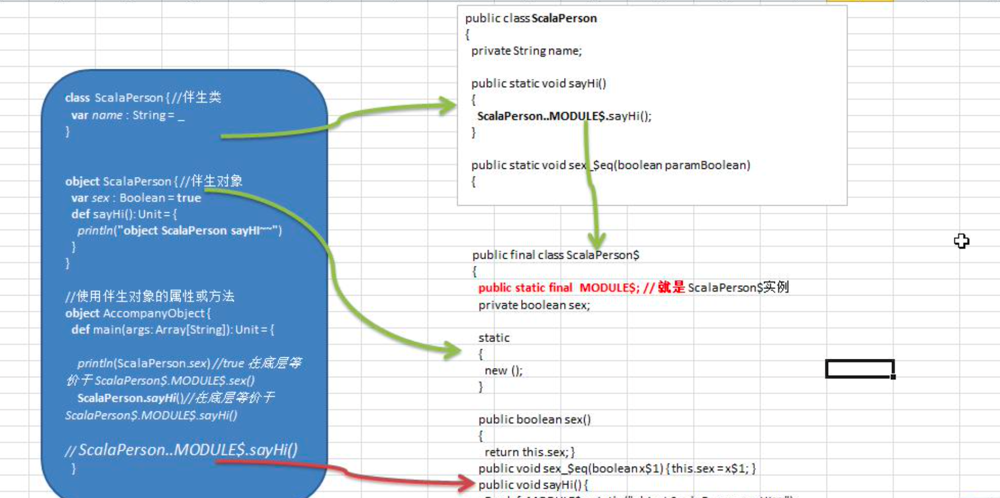
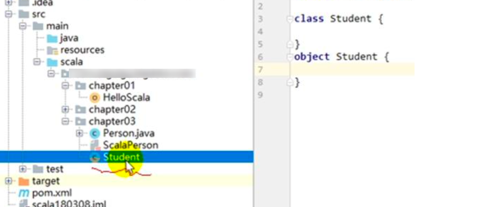
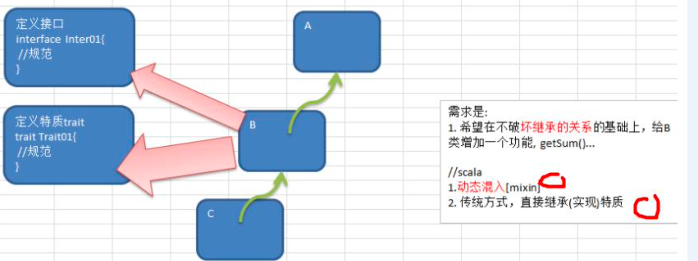
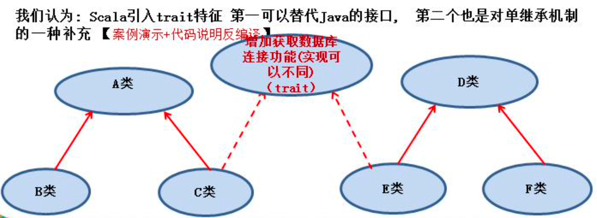
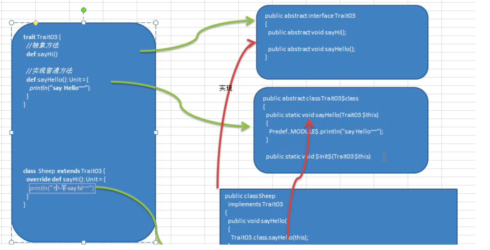
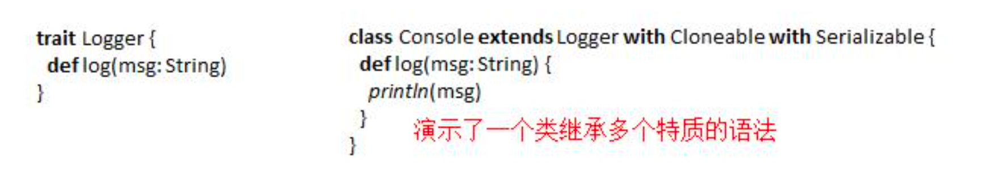
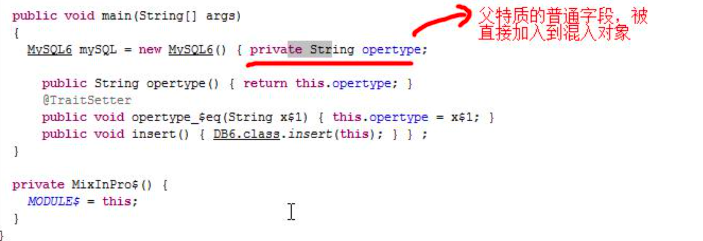

# 面向对象编程(高级特性)

## 8.1 静态属性和静态方法

### 8.1.1 静态属性-提出问题

提出问题的主要目的就是让大家思考解决之道，从而引出我要讲的知识点. 说:有一群小孩在玩堆雪人,不时有新的小孩加入,请问如何知道现在共有多少人在玩?请使用面向

对象的思想，编写程序解决。


### 8.1.2 基本介绍

Scala中静态的概念-伴生对象
Scala 语言是完全面向对象(万物皆对象)的语言，所以并没有静态的操作(即在 Scala 中没有静态的概 念)。但是为了能够和 Java 语言交互(因为 Java 中有静态概念)，就产生了一种特殊的对象来模拟类 对象，我们称之为类的伴生对象。这个类的所有静态内容都可以放置在它的伴生对象中声明和调用


### 8.1.3 伴生对象的快速入门

```scala
object AccompanyObject {
  def main(args: Array[String]): Unit = {

    println(ScalaPerson.sex) //true 在底层等价于 ScalaPerson$.MODULE$.sex()
    ScalaPerson.sayHi()//在底层等价于 ScalaPerson$.MODULE$.sayHi()
  }
}

//说明
//1. 当在同一个文件中，有 class ScalaPerson 和 object ScalaPerson
//2. class ScalaPerson 称为伴生类,将非静态的内容写到该类中
//3. object ScalaPerson 称为伴生对象,将静态的内容写入到该对象(类)
//4. class ScalaPerson 编译后底层生成 ScalaPerson类 ScalaPerson.class
//5. object ScalaPerson 编译后底层生成 ScalaPerson$类 ScalaPerson$.class
//6. 对于伴生对象的内容，我们可以直接通过 ScalaPerson.属性 或者方法

//伴生类
class ScalaPerson { //
  var name : String = _
}

//伴生对象
object ScalaPerson { //
  var sex : Boolean = true
  def sayHi(): Unit = {
    println("object ScalaPerson sayHI~~")
  }
}

```

对快速入门案例的源码剖析




### 8.1.4 伴生对象的小结

1. Scala 中伴生对象采用 object 关键字声明，伴生对象中声明的全是 "静态"内容，可以通过伴生 对象名称直接调用。
2. 伴生对象对应的类称之为伴生类，伴生对象的名称应该和伴生类名一致。
3. 伴生对象中的属性和方法都可以通过伴生对象名(类名)直接调用访问
4. 从语法角度来讲，所谓的伴生对象其实就是类的静态方法和成员的集合
5. 从技术角度来讲，scala 还是没有生成静态的内容，只不过是将伴生对象生成了一个新的类，实现属性和方法的调用。
6. 从底层原理看，伴生对象实现静态特性是依赖于 **public static final MODULE$** 实现的。
7. 伴生对象的声明应该和伴生类的声明在同一个源码文件中(如果不在同一个文件中会运行错 误!)，但是如果没有伴生类，也就没有所谓的伴生对象了，所以放在哪里就无所谓了。
8. 如果 class A 独立存在，那么 A 就是一个类， 如果 object A 独立存在，那么 A 就是一个"静态 "性质的对象[即类对象], 在 object A 中声明的属性和方法可以通过 A.属性 和 A.方法 来实现调用
9. 当一个文件中，存在伴生类和伴生对象时，文件的图标会发生变化




### 8.1.5 最佳实践-使用伴生对象完成小孩玩游戏

​	如果,设计一个 var total Int 表示总人数,我们在创建一个小孩时，就把 total 加 1,并且 total 是所有对象共享的就 ok 了!，我们使用伴生对象来解决

```scala
object ChildJoinGame {
  def main(args: Array[String]): Unit = {
    //创建三个小孩
    val child0 = new Child02("白骨精")
    val child1 = new Child02("蜘蛛精")
    val child2 = new Child02("黄鼠狼精")
    Child02.joinGame(child0)
    Child02.joinGame(child1)
    Child02.joinGame(child2)
    Child02.showNum()
  }
}

class Child02(cName: String) {
  var name = cName
}

object Child02 {
  //统计共有多少小孩的属性
  var totalChildNum = 0

  def joinGame(child: Child02): Unit = {
    printf("%s 小孩加入了游戏\n", child.name)
    //totalChildNum 加1
    totalChildNum += 1
  }

  def showNum(): Unit = {
    printf("当前有%d小孩玩游戏\n", totalChildNum)
  }
}
```


### 8.1.6伴生对象-apply 方法

在伴生对象中定义 apply 方法，可以实现: 类名(参数) 方式来创建对象实例.

```scala
package com.atguigu.chapter08

object ApplyDemo01 {
  def main(args: Array[String]): Unit = {
    val list = List(1, 2, 5)
    println(list)

    val pig = new Pig("小花")

    //使用apply方法来创建对象
    val pig2 = Pig("小黑猪") //自动  apply(pName: String)
    val pig3 = Pig() // 自动触发 apply()

    println("pig2.name=" + pig2.name) //小黑猪
    println("pig3.name=" + pig3.name) //匿名猪猪
  }
}

//案例演示apply方法.
class Pig(pName:String) {
  var name: String = pName
}

object Pig {
  //编写一个apply
  def apply(pName: String): Pig = new Pig(pName)

  def apply(): Pig = new Pig("匿名猪猪")
}

```


## 8.2 单例对象


## 8.3 接口


### 8.3.1回顾 Java 接口

- 声明接口 

  ```scala
  interface 接口名
  ```

- 实现接口

   ```scala
  class 类名 implements 接口名 1，接口 2
   ```

- java接口的使用小结
  1. 在 Java 中, 一个类可以实现多个接口。  
  2. 在 Java 中，接口之间支持多继承
  3. 接口中属性都是常量
  4. 接口中的方法都是抽象的


### 8.3.2Scala 接口的介绍

1.  从面向对象来看，接口并不属于面向对象的范畴，Scala 是纯面向对象的语言，在 Scala 中，没 有接口。

2. Scala语言中，采用特质trait(特征)来代替接口的概念，也就是说，多个类具有相同的特征(特 征)时，就可以将这个特质(特征)独立出来，采用关键字 trait 声明。理解 trait 等价于(interface + abstract class)
3.  scala 继承特质(trait)的示意图




### 8.3.3trait 的声明

```scala
trait 特质名 { trait 体
}
```

1) trait 命名 一般首字母大写.

```scala
object T1 extends Serializable {
}
```

Serializable: 就是 scala 的一个特质。

在 scala 中，java 中的接口可以当做特质使用

```scala


object TraitDemo01 {
  def main(args: Array[String]): Unit = {

  }
}

//trait Serializable extends Any with java.io.Serializable
//在scala中，java的接口都可以当做trait来使用(如上面的语法)
object T1 extends Serializable {
}
object T2 extends  Cloneable {

}
```


### 8.3.4Scala 中 trait 的使用

一个类具有某种特质(特征)，就意味着这个类满足了这个特质(特征)的所有要素，所以在使用时，也采用了 extends 关键字，如果有多个特质或存在父类，那么需要采用 with 关键字连接

1) 没有父类

```scala
class 类名 extends 特质 1 with 特质 2 with 特质 3 ..
```

2) 有父类

```scala
class 类名 extends 父类 with 特质 1 with 特质 2 with 特质 3
```

## 8.4 特质(trait)


### 8.4.1 特质的快速入门案例



### 8.4.2 代码完成

```scala

object TraitDemo02 {
  def main(args: Array[String]): Unit = {
    val c = new C()
    val f = new F()
    c.getConnect() // 连接mysql数据库...
    f.getConnect() // 连接oracle数据库..
  }
}

//按照要求定义一个trait
trait Trait01 {
  //定义一个规范
  def getConnect()
}

//先将六个类的关系写出
class A {}

class B extends A {}
class C extends A with Trait01{
  override def getConnect(): Unit = {
    println("连接mysql数据库...")
  }
}

class D {}
class E extends D {}
class F extends D with Trait01 {
  override def getConnect(): Unit = {
    println("连接oracle数据库..")
  }
}
```


### 8.4.3特质 trait 的再说明

Scala提供了特质(trait)，特质可以同时拥有抽象方法和具体方法，一个类可以实现/继承多个 特质。【案例演示+反编译】

```scala
package com.atguigu.chapter08.mytrait

object TraitDemo03 {
  def main(args: Array[String]): Unit = {
    println("~~~~")
    //创建sheep
    val sheep = new Sheep
    sheep.sayHi()
    sheep.sayHello()
  }
}

//当一个trait有抽象方法和非抽象方法时
//1. 一个trait在底层对应两个 Trait03.class 接口
//2. 还对应 Trait03$class.class Trait03$class抽象类

trait Trait03 {
  //抽象方法
  def sayHi()

  //实现普通方法
  def sayHello(): Unit = {
    println("say Hello~~")
  }
}


//当trait有接口和抽象类是
//1.class Sheep extends Trait03 在底层 对应
//2.class Sheep implements  Trait03
//3.当在 Sheep 类中要使用 Trait03的实现的方法，就通过  Trait03$class
class Sheep extends Trait03 {
  override def sayHi(): Unit = {
    println("小羊say hi~~")
  }
}

```



1. 特质中没有实现的方法就是抽象方法。类通过 extends 继承特质，通过 with 可以继承多个特质 
2. 所有的 java 接口都可以当做 Scala 特质使用



### 8.4.4 带有特质的对象，动态混入

1. 除了可以在类声明时继承特质以外，还可以在构建对象时混入特质，扩展目标类的功能【反编 译看动态混入本质】
2. 此种方式也可以应用于对抽象类功能进行扩展
3. 动态混入是 Scala 特有的方式(java 没有动态混入)，可在不修改类声明/定义的情况下，扩展类的功能，非常的灵活，耦合性低 。
4. 动态混入可以在不影响原有的继承关系的基础上，给指定的类扩展功能。[如何理解] 
5.  同时要注意动态混入时，如果抽象类有抽象方法，如何混入
6. 案例演示

```scala
package com.atguigu.chapter08.mixin

object MixInDemo01 {
  def main(args: Array[String]): Unit = {
    //在不修改 类的定义基础，让他们可以使用trait方法
    val oracleDB = new OracleDB with Operate3
    oracleDB.insert(100) //

    val mySQL = new MySQL3 with Operate3
    mySQL.insert(200)

    //如果一个抽象类有抽象方法，如何动态混入特质
    val mySql_ = new MySQL3_ with Operate3 {
        override def say(): Unit = {
        println("say")
      }
    }
    mySql_.insert(999)
    mySql_.say()
  }
}

trait Operate3 { //特质
  def insert(id: Int): Unit = { //方法（实现）
    println("插入数据 = " + id)
  }
}

class OracleDB { //空
}
abstract class MySQL3 { //空
}

abstract class MySQL3_ { //空
  def say()
}

```

在 Scala 中创建对象共有几种方式?

1. new 对象
2. apply 创建 
3. 匿名子类方式 
4. 动态混入

### 8.4.5 叠加特质

- 基本介绍

构建对象的同时如果混入多个特质，称之为叠加特质，那么特质声明顺序从左到右，方法执行顺序从右到左。

- 叠加特质应用案例

  目的:分析叠加特质时，对象的构建顺序，和执行方法的顺序

  ```scala
  package com.atguigu.chapter08.mixin
  
  //看看混入多个特质的特点(叠加特质)
  object AddTraits {
    def main(args: Array[String]): Unit = {
  
      //说明
      //1. 创建 MySQL4实例时，动态的混入 DB4 和 File4
  
      //研究第一个问题，当我们创建一个动态混入对象时，其顺序是怎样的
      //总结一句话
      //Scala在叠加特质的时候，会首先从后面的特质开始执行(即从左到右)
      //1.Operate4...
      //2.Data4
      //3.DB4
      //4.File4
      val mysql = new MySQL4 with DB4 with File4
      println(mysql)
  
      //研究第2个问题，当我们执行一个动态混入对象的方法，其执行顺序是怎样的
      //顺序是，(1)从右到左开始执行 , (2)当执行到super时，是指的左边的特质 (3) 如果左边没有特质了，则super就是父特质
      //1. 向文件"
      //2. 向数据库
      //3. 插入数据 100
      mysql.insert(100)
  
      println("===================================================")
      //练习题
      val mySQL4 = new MySQL4 with  File4 with DB4
      mySQL4.insert(999)
      //构建顺序
      //1.Operate4...
      //2.Data4
      //3.File4
      //4.DB4
  
      //执行顺序
      //1. 向数据库
      //2. 向文件
      //3. 插入数据 = 999
    }
  }
  
  trait Operate4 { //特点
    println("Operate4...")
  
    def insert(id: Int) //抽象方法
  }
  
  trait Data4 extends Operate4 { //特质，继承了Operate4
    println("Data4")
  
    override def insert(id: Int): Unit = { //实现/重写 Operate4 的insert
      println("插入数据 = " + id)
    }
  }
  
  trait DB4 extends Data4 { //特质，继承 Data4
    println("DB4")
  
    override def insert(id: Int): Unit = { // 重写 Data4 的insert
      println("向数据库")
      super.insert(id)
    }
  }
  
  trait File4 extends Data4 { //特质，继承 Data4
    println("File4")
  
    override def insert(id: Int): Unit = { // 重写 Data4 的insert
      println("向文件")
      //super.insert(id) //调用了insert方法(难点)，这里super在动态混入时，不一定是父类
      //如果我们希望直接调用Data4的insert方法，可以指定，如下
      //说明：super[?] ?的类型，必须是当前的特质的直接父特质(超类)
      super[Data4].insert(id)
    }
  }
  
  class MySQL4  {} //普通类
  
  ```

  

- 叠加特质注意事项和细节
  1. 特质声明顺序从左到右。
  2. Scala在执行叠加对象的方法时，会首先从后面的特质(从右向左)开始执行
  3. Scala中特质中如果调用super，并不是表示调用父特质的方法，而是向前面(左边)继续 查找特质，如果找不到，才会去父特质查找
  4. 如果想要调用具体特质的方法，可以指定:**super[**特质**].xxx(**...**).**其中的泛型必须是该特质的 直接超类类型

### 8.4.6 当作富接口使用的特质

富接口:即该特质中既有抽象方法，又有非抽象方法

```scala
trait Operate {
def insert( id : Int ) //抽象
def pageQuery(pageno:Int, pagesize:Int): Unit = { //实现
println("分页查询") }
}
```


### 8.4.7 特质中的具体字段

特质中可以定义具体字段，如果初始化了就是具体字段，如果不初始化就是抽象字段。混入该特质的类就具有了该字段，字段不是继承，而是直接加入类，成为自己的字段。【案例演示+反编译】

```scala
package com.atguigu.chapter08.mixin

object MixInPro {
  def main(args: Array[String]): Unit = {
    val mySQL = new MySQL6 with DB6 {
      override var sal = 10
    }
  }
}

trait DB6  {
  var sal:Int //抽象字段
  var opertype : String = "insert"
  def insert(): Unit = {
  }
}
class MySQL6 {}
```

-  反编译后的代码

  

### 8.4.8 特质中的抽象字段

特质中未被初始化的字段在具体的子类中必须被重写。

### 8.4.9 特质构造顺序

- 介绍

  特质也是有构造器的，构造器中的内容由“字段的初始化”和一些其他语句构成。具体实现请参考“特质叠加”

- 第一种特质构造顺序(声明类的同时混入特质)

  1. 调用当前类的超类构造器

  2. 第一个特质的父特质构造器

  3. 第一个特质构造器

  4. 第二个特质构造器的父特质构造器, 如果已经执行过，

     就不再执行

  5. 第二个特质构造器

  6. .......重复 4,5 的步骤(如果有第 3 个，第 4 个特质)

  7. 当前类构造器 [案例演示]

- 第 2 种特质构造顺序(在构建对象时，动态混入特质)
  1. 调用当前类的超类构造器
  2. 当前类构造器
  3. 第一个特质构造器的父特质构造器
  4. 第一个特质构造器.
  5. 第二个特质构造器的父特质构造器, 如果已经执行过，就不再执行
  6. 第二个特质构造器
  7. .......重复 5,6 的步骤(如果有第 3 个，第 4 个特质)
  8. 当前类构造器
- 分析两种方式对构造顺序的影响
   第 1 种方式实际是构建类对象, 在混入特质时，该对象还没有创建。
   第 2 种方式实际是构造匿名子类，可以理解成在混入特质时，对象已经创建了

```scala
package com.atguigu.chapter08.mixin

object MixInSeq {
  def main(args: Array[String]): Unit = {

    //这时FF是这样 形式 class FF extends EE with CC with DD
    /*
    调用当前类的超类构造器
第一个特质的父特质构造器
第一个特质构造器
第二个特质构造器的父特质构造器, 如果已经执行过，就不再执行
第二个特质构造器
.......重复4,5的步骤(如果有第3个，第4个特质)
当前类构造器   [案例演示]

     */
    //1. E...
    //2. A...
    //3. B....
    //4. C....
    //5. D....
    //6. F....
    val ff1 = new FF()

    println(ff1)

    //这时我们是动态混入
    /*
    先创建 new KK 对象，然后再混入其它特质

    调用当前类的超类构造器
当前类构造器
第一个特质构造器的父特质构造器
第一个特质构造器.
第二个特质构造器的父特质构造器, 如果已经执行过，就不再执行
第二个特质构造器
.......重复5,6的步骤(如果有第3个，第4个特质)
当前类构造器   [案例演示]

     */
    //1. E...
    //2. K....
    //3. A...
    //4. B
    //5. C
    //6. D
    println("=======================")
    val ff2 = new KK with CC with DD
    println(ff2)

  }
}

trait AA {
  println("A...")
}

trait BB extends AA {
  println("B....")
}

trait CC extends BB {
  println("C....")
}

trait DD extends BB {
  println("D....")
}

class EE { //普通类
  println("E...")
}

class FF extends EE with CC with DD { //先继承了EE类，然后再继承CC 和DD
  println("F....")
}

class KK extends EE { //KK直接继承了普通类EE
  println("K....")
}
```


### 8.4.10 扩展类的特质

 特质可以继承类，以用来拓展该特质的一些功能

```scala
trait LoggedException extends Exception{ def log(): Unit ={
println(getMessage()) // 方法来自于 Exception 类 }
}
```

所有混入该特质的类，会自动成为那个特质所继承的超类的子类

```scala
//说明
//1. LoggedException 继承了 Exception
//2. LoggedException 特质就可以 Exception 功能 trait LoggedException extends Exception {
def log(): Unit = {
println(getMessage()) // 方法来自于 Exception 类
} }
```

如果混入该特质的类，已经继承了另一个类(A 类)，则要求 A 类是特质超类的子类，否则就会出现 了多继承现象，发生错误

```scala


object ExtendTraitDemo01 {
  def main(args: Array[String]): Unit = {
    println("haha~~")
  }
}

//说明
//1. LoggedException 继承了 Exception
//2. LoggedException 特质就可以  Exception 功能
trait LoggedException extends Exception {
  def log(): Unit = {
    println(getMessage()) // 方法来自于Exception类
  }
}

//因为 UnhappyException 继承了 LoggedException
//而 LoggedException 继承了  Exception
//UnhappyException 就成为 Exception子类
class UnhappyException extends LoggedException{
  // 已经是Exception的子类了，所以可以重写方法
  override def getMessage = "错误消息！"
}

// 如果混入该特质的类，已经继承了另一个类(A类)，则要求A类是特质超类的子类，
// 否则就会出现了多继承现象，发生错误。


class UnhappyException2 extends IndexOutOfBoundsException with LoggedException{
  // 已经是Exception的子类了，所以可以重写方法
  override def getMessage = "错误消息！"
}

class CCC {}

//错误的原因是 CCC 不是 Exception子类
//class UnhappyException3 extends CCC with LoggedException{
//  // 已经是Exception的子类了，所以可以重写方法
//  override def getMessage = "错误消息！"
//}
```


### 8.4.11 自身类型

- 说明 

  自身类型:主要是为了解决特质的循环依赖问题，同时可以确保特质在不扩展某个类的情况下，依然可以做到限制混入该特质的类的类型。

- 应用案例

  举例说明自身类型特质，以及如何使用自身类型特质

  ```scala
  object SelfTypeDemo {
    def main(args: Array[String]): Unit = {
  
  
  
    }
  }
  
  //Logger就是自身类型特质,当这里做了自身类型后，那么
  // trait Logger extends Exception,要求混入该特质的类也是 Exception子类
  trait Logger {
    // 明确告诉编译器，我就是Exception,如果没有这句话，下面的getMessage不能调用
    this: Exception =>
    def log(): Unit ={
      // 既然我就是Exception, 那么就可以调用其中的方法
      println(getMessage)
    }
  }
  
  //class Console extends  Logger {} //对吗? 错误
  class Console extends Exception with Logger {}//对吗?
  
  
  ```


## 8.5 嵌套类 //看源码,面试

### 8.5.1Scala 嵌套类的使用 1

请编写程序，定义 Scala 的成员内部类和静态内部类，并创建相应的对象实例。

Java代码如下:

```java
public class JavaInnerClass {
    public static void main(String[] args) {

        //使用
        //创建一个外部类对象
        OuterClass outer1 = new OuterClass();
        //创建一个外部类对象
        OuterClass outer2 = new OuterClass();

        // 创建Java成员内部类
        // 说明在Java中，将成员内部类当做一个属性，因此使用下面的方式来创建 outer1.new InnerClass().
        OuterClass.InnerClass inner1 = outer1.new InnerClass();
        OuterClass.InnerClass inner2 = outer2.new InnerClass();

        //下面的方法调用说明在java中，内部类只和类型相关，也就是说,只要是
        //OuterClass.InnerClass 类型的对象就可以传给 形参 InnerClass ic
        inner1.test(inner2);
        inner1.test(inner1);

        inner2.test(inner1);

        // 创建Java静态内部类
        // 因为在java中静态内部类是和类相关的，使用 new OuterClass.StaticInnerClass()
        OuterClass.StaticInnerClass staticInner = new OuterClass.StaticInnerClass();


    }
}

class OuterClass { //外部类
    class InnerClass { //成员内部类
        //test方法可以接收 InnerClass实例
        public void test(InnerClass ic) {
            System.out.println(ic);
        }
    }

    static class StaticInnerClass { //静态内部类
    }
}
```

Scala 代码

```scala
import com.atguigu.chapter08.innerclass

object ScalaInnerClassDemo {
  def main(args: Array[String]): Unit = {
    //测试1. 创建了两个外部类的实例
    val outer1 : ScalaOuterClass = new ScalaOuterClass();
    val outer2 : ScalaOuterClass = new ScalaOuterClass();

    //在scala中，创建成员内部类的语法是
    //对象.内部类  的方式创建, 这里语法可以看出在scala中，默认情况下内部类实例和外部对象关联
    val inner1 = new outer1.ScalaInnerClass
    val inner2 = new outer2.ScalaInnerClass

    //测试一下使用inner1 去调用 info()
    inner1.info()

    //这里我们去调用test
    inner1.test(inner1)
    //在默认情况下,scala的内部类的实例和创建该内部类实例的外部对象关联.
    //
    inner1.test(inner2)
    inner2.test(inner2)


    //创建静态内部类实例
    val staticInner= new ScalaOuterClass.ScalaStaticInnerClass()


  }
}

//外部类
//内部类访问外部类的属性的方法1 外部类名.this.属性
//class ScalaOuterClass {
//  //定义两个属性
//  var name = "scoot"
//  private var sal = 30000.9
//
//  class ScalaInnerClass { //成员内部类,
//
//    def info() = {
//      // 访问方式：外部类名.this.属性名
//      // 怎么理解 ScalaOuterClass.this 就相当于是 ScalaOuterClass 这个外部类的一个实例,
//      // 然后通过 ScalaOuterClass.this 实例对象去访问 name 属性
//      // 只是这种写法比较特别，学习java的同学可能更容易理解 ScalaOuterClass.class 的写法.
//      println("name = " + ScalaOuterClass.this.name
//        + " sal =" + ScalaOuterClass.this.sal)
//    }
//  }
//
//}

//外部类
//内部类访问外部类的属性的方法2 使用别名的方式
//1. 将外部类属性，写在别名后面
class ScalaOuterClass {
  myouter => //这里我们可以这里理解 外部类的别名 看做是外部类的一个实例
  class ScalaInnerClass { //成员内部类,

    def info() = {
      // 访问方式：外部类别名.属性名
      // 只是这种写法比较特别，学习java的同学可能更容易理解 ScalaOuterClass.class 的写法.
      println("name~ = " + myouter.name
        + " sal~ =" + myouter.sal)
    }
    //这里有一个方法,可以接受ScalaInnerClass实例
    //下面的 ScalaOuterClass#ScalaInnerClass 类型投影的作用就是屏蔽 外部对象对内部类对象的
    //影响
    def test(ic: ScalaOuterClass#ScalaInnerClass): Unit = {
      System.out.println("使用了类型投影" + ic)
    }

  }
  //定义两个属性
  var name = "jack"
  private var sal = 800.9
}


object ScalaOuterClass { //伴生对象
class ScalaStaticInnerClass { //静态内部类
}
}

```

### 8.5.2Scala 嵌套类的使用 2

请编写程序，在内部类中访问外部类的属性。

方式 1

内部类如果想要访问外部类的属性，可以通过外部类对象访问。 即:访问方式:外部类名**.this.**属性名

### 8.5.3 类型投影

先看一段代码，引出类型投影

```scala
//外部类
//内部类访问外部类的属性的方法2 使用别名的方式
//1. 将外部类属性，写在别名后面
class ScalaOuterClass {
  myouter => //这里我们可以这里理解 外部类的别名 看做是外部类的一个实例
  class ScalaInnerClass { //成员内部类,

    def info() = {
      // 访问方式：外部类别名.属性名
      // 只是这种写法比较特别，学习java的同学可能更容易理解 ScalaOuterClass.class 的写法.
      println("name~ = " + myouter.name
        + " sal~ =" + myouter.sal)
    }
    //这里有一个方法,可以接受ScalaInnerClass实例
    //下面的 ScalaOuterClass#ScalaInnerClass 类型投影的作用就是屏蔽 外部对象对内部类对象的
    //影响
    def test(ic: ScalaOuterClass#ScalaInnerClass): Unit = {
      System.out.println("使用了类型投影" + ic)
    }

  }
  //定义两个属性
  var name = "jack"
  private var sal = 800.9
}


object ScalaOuterClass { //伴生对象
class ScalaStaticInnerClass { //静态内部类
}
}
```


- 解决方式-使用类型投影

  类型投影是指:在方法声明上，如果使用 外部类#内部类 的方式，表示忽略内部类的对象关系， 等同于 Java 中内部类的语法操作，我们将这种方式称之为 类型投影(即:忽略对象的创建方式， 只考虑类型)