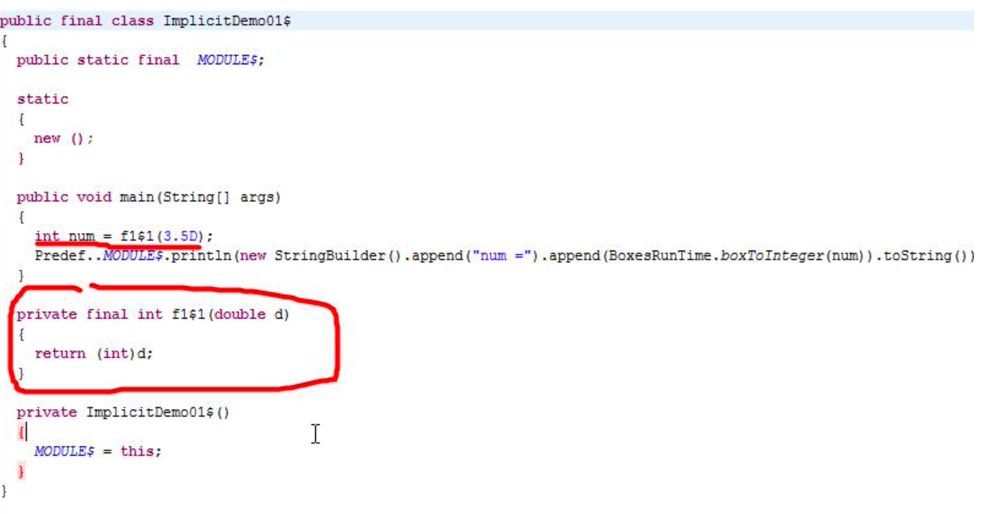

# 隐式转换和隐式值

## 9.1 隐式转换

### 9.1.1  提出问题

先看一段代码，引出隐式转换的实际需要=>指定某些数据类型的相互转化

```scala
object Scala01 {
def main(args: Array[String]): Unit = {
val num : Int = 3.5 //?错 高精度->低精度
println(num) }
}
```

### 9.1.2 隐式函数基本介绍

隐式转换函数是以 implicit 关键字声明的带有单个参数的函数。这种函数将会自动应用，将值从一种类型转换为另一种类型


### 9.1.3 隐式函数快速入门

使用隐式函数可以优雅的解决数据类型转换，以前面的案例入门.

```scala

object ImplicitDemo01 {
  def main(args: Array[String]): Unit = {

    //编写一个隐式函数转成 Double->Int 转换
    //隐式函数应当在作用域才能生效
    implicit def f1(d:Double): Int = { //底层 生成 f1$1
      d.toInt
    }

    implicit def f2(f:Float): Int = {
      f.toInt
    }

    //这里我们必须保证隐式函数的匹配只能是唯一的.
//    implicit def f3(f1:Float): Int = {
//      f1.toInt
//    }


    val num: Int = 3.5 // 底层编译 f1$1(3.5)
    val num2: Int = 4.5f //
    println("num =" + num)

  }
}

```


- 反编译后的代码




### 9.1.4 隐式转换的注意事项和细节

1) 隐式转换函数的函数名可以是任意的，隐式转换与函数名称无关，只与函数签名(函数参数类 型和返回值类型)有关。

2) 隐式函数可以有多个(即:隐式函数列表)，但是需要保证在当前环境下，只有一个隐式函数能 被识别


## 9.2 隐式转换丰富类库功能

### 9.2.1 快速入门案例

使用隐式转换方式动态的给 MySQL 类增加 delete 方法

```scala
object ImplicitDemo02 {


  def main(args: Array[String]): Unit = {

    //编写一个隐式函数，丰富mySQL功能
    implicit def addDelete(msql:MySQL): DB = {
      new DB
    }

    //创建mysql对象
    val mySQL = new MySQL
    mySQL.insert()
    mySQL.delete() // 编译器工作 分析 addDelete$1(mySQL).delete()
    mySQL.update()

  }
}

class MySQL {
  def insert(): Unit = {
    println("insert")
  }
}

class DB {
  def delete(): Unit = {
    println("delete")
  }

  def update(): Unit = {
    println("update")
  }
}

class Dog {

}
```

## 9.3 隐式值

### 9.3.1 基本介绍

隐式值也叫隐式变量，将某个形参变量标记为 implicit，所以编译器会在方法省略隐式参数的情况 下去搜索作用域内的隐式值作为缺省参数

### 9.3.2 快速入门

```scala
object ImplicitValDemo03 {
  def main(args: Array[String]): Unit = {

    implicit val str1: String = "jack~" //这个就是隐式值

    //implicit name: String ：name就是隐式参数
    def hello(implicit name: String): Unit = {
      println(name + " hello")
    }

    hello //底层 hello$1(str1);

  }
}
```

### 9.3.3一个案例说明 隐式值 ，默认值，传值的优先级

```scala
package com.atguigu.chapter09


//小结
//1. 当在程序中，同时有 隐式值，默认值，传值
//2. 编译器的优先级为 传值 > 隐式值 > 默认值
//3. 在隐式值匹配时，不能有二义性
//4. 如果三个 （隐式值，默认值，传值） 一个都没有，就会报错

object ImplicitVal02 {
  def main(args: Array[String]): Unit = {
    // 隐式变量（值）
//    implicit val name: String = "Scala"
    //implicit val name1: String = "World"

    //隐式参数
    def hello(implicit content: String = "jack"): Unit = {
      println("Hello " + content)
    } //调用hello
    hello

    //当同时有implicit 值和默认值，implicit 优先级高
    def hello2(implicit content: String = "jack"): Unit = {
      println("Hello2 " + content)
    } //调用hello
    hello2


    //说明
    //1. 当一个隐式参数匹配不到隐式值，仍然会使用默认值

    implicit val name: Int = 10
    def hello3(implicit content: String = "jack"): Unit = {
      println("Hello3 " + content)
    } //调用hello
    hello3 //  hello3 jack

//    //当没有隐式值，没有默认值，又没有传值，就会报错
//    def hello4(implicit content: String ): Unit = {
//      println("Hello4 " + content)
//    } //调用hello
//    hello4 //  hello3 jack
  }
}
```

## 9.4 隐式类

### 9.4.1 基本介绍

​	在 scala2.10 后提供了隐式类，可以使用 implicit 声明类，隐式类的非常强大，同样可以扩展类的功 能，比前面使用隐式转换丰富类库功能更加的方便，在集合中隐式类会发挥重要的作用。


### 9.4.2 隐式类使用有如下几个特点:

1. 其所带的构造参数有且只能有一个
2. 隐式类必须被定义在“类”或“伴生对象”或“包对象”里，即隐式类不能是 顶级的(top-levelobjects)。
3. 隐式类不能是 case class(case class 在后续介绍 样例类)
4. 作用域内不能有与之相同名称的标识符

### 9.4.3 应用案例

看一个关于隐式类的案例，进一步认识隐式类

```scala
object ImplicitClassDemo {

  def main(args: Array[String]): Unit = {
    //DB1会对应生成隐式类
    //DB1是一个隐式类, 当我们在该隐式类的作用域范围，创建MySQL1实例
    //该隐式类就会生效, 这个工作仍然编译器完成
    //看底层..
    implicit class DB1(val m: MySQL1) { //ImplicitClassDemo$DB1$2
      def addSuffix(): String = {
        m + " scala"
      }
    }


    //创建一个MySQL1实例
    val mySQL = new MySQL1
    mySQL.sayOk()
    mySQL.addSuffix() //研究 如何关联到 DB1$1(mySQL).addSuffix();

    implicit def f1(d:Double): Int = {
      d.toInt
    }

    def test1(n1:Int): Unit = {
      println("ok")
    }
    test1(10.1)

  }
}

class DB1 {}


class MySQL1 {
  def sayOk(): Unit = {
    println("sayOk")
  }
}
```


## 9.5 隐式的转换时机

1. 当方法中的参数的类型与目标类型不一致时, 或者是赋值时。

   ```scala
    implicit def f1(d: Double): Int = {
         d.toInt
       }
   
       def test1(n1: Int): Unit = {
         println("ok")
       }
   
       test1(10.1)
   ```

2. 当对象调用所在类中不存在的方法或成员时，编译器会自动将对象进行隐式转换(根据类型)


## 9.6 隐式解析机制

​	即编译器是如何查找到缺失信息的，解析具有以下两种规则:

1. 首先会在当前代码作用域下查找隐式实体(隐式方法、隐式类、隐式对象)。(一般是这种情况)
2. 如果第一条规则查找隐式 实体失败，会继续在隐式参数的类型的作用域里查找。类型的作用域是指与该类型相关联的全部伴生模块，一个隐式实体的类型 T 它的查找范围如下(第二种情况范围广且 复杂在使用时，应当尽量避免出现):
   1. 如果 T 被定义为 T with A with B with C,那么 A,B,C 都是 T 的部分，在 T 的隐式解析过程中， 它们的伴生对象都会被搜索。
   2. 如果 T 是参数化类型，那么类型参数和与类型参数相关联的部分都算作 T 的部分，比如 List[String]的隐式搜索会搜索 List 的伴生对象和 String 的伴生对象。
   3. 如果 T 是一个单例类型 p.T，即 T 是属于某个 p 对象内，那么这个 p 对象也会被搜索。 
   4.  如果 T 是个类型注入 S#T，那么 S 和 T 都会被搜索


## 9.7 在进行隐式转换时，需要遵守两个基本的前提:

1. 不能存在二义性
2. 隐式操作不能嵌套使用 [举例:]如:隐式转换函数

```scala
object ImplicitNotice {
  def main(args: Array[String]): Unit = {

    //1. 隐式转换不能有二义性
    //2. 隐式转换不能嵌套使用

    implicit def f1(d: Double): Int = {
      d.toInt
      //val num2:Int = 2.3 //底层 f1$1(2.3) //f1$1对应的就是f1,就会形成递归
    }

    val num1: Int = 1.1
  }
}

```

