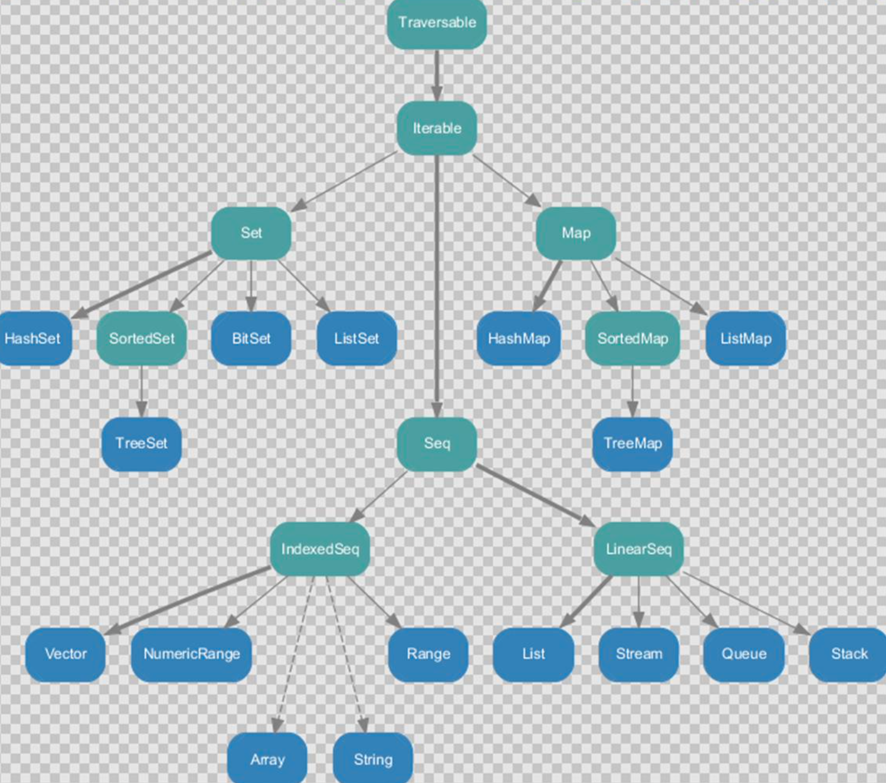
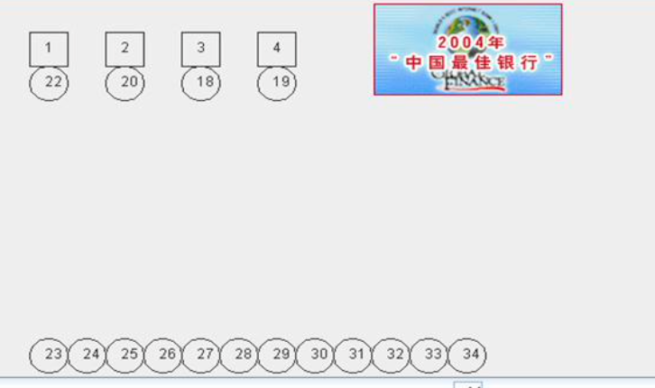

# 数据结构(上)-集合

## 10.1 数据结构特点

### 10.1.1 scala 集合基本介绍

uml => 统一建模语言

1. Scala同时支持不可变集合和可变集合，不可变集合可以安全的并发访问。两个主要的包:

   1. 不可变集合:`scala.collection.immutable`
   2. 可变集合: `scala.collection.mutable`

2.  Scala默认采用不可变集合，对于几乎所有的集合类，Scala都同时提供了可变(`mutable`)和不可

   变(`immutable`)的版本

3. Scala的集合有三大类:序列Seq(有序的,LinearSeq)、集Set、映射Map【key->value】，所有的

   集合都扩展自 Iterable 特质，在 Scala 中集合有可变(mutable)和不可变(immutable)两种类型。


### 10.1.2 可变集合和不可变集合举例

1. 不可变集合:scala 不可变集合，就是这个集合本身不能动态变化。(类似 java 的数组，是不可 以动态增长的)

2. 可变集合:可变集合，就是这个集合本身可以动态变化的。(比如:ArrayList , 是可以动态增长的) 

3. 使用 java 做了一个简单的案例说明

   ```java
   import java.util.ArrayList;
   
   public class JavaCollection {
       public static void main(String[] args) {
           //不可变集合类似java的数组
           int[] nums = new int[3];
           nums[2] = 11; //?
           nums[2] = 22;
           //nums[3] = 90; //?
   
   //        String[] names = {"bj", "sh"};
   //        System.out.println(nums + " " + names);
   //
   //        //可变集合举例
           ArrayList al = new ArrayList<String>();
           al.add("zs");
           al.add("zs2");
           System.out.println(al + " 地址= " + al.hashCode()); //地址
           al.add("zs3");
           System.out.println(al + " 地址2=" + al.hashCode()); //地址
   
       }
   }
   ```

## 10.2 不可变集合继承层次一览图

### 10.2.1 图



### 10.2.2 小结:

1. Set、Map是Java中也有的集合
2. Seq是Java没有的，我们发现List归属到Seq了,因此这里的List就和java不是同 一个概念了
3. 我们前面的 for 循环有一个 1 to 3 ,就是 IndexedSeq 下的 Vector 
4. String 也是属于 IndexeSeq
5. 我们发现经典的数据结构比如 Queue 和 Stack 被归属到 LinearSeq
6. 大家注意 Scala 中的 Map 体系有一个 SortedMap,说明 Scala 的 Map 可以支持 排序
7. IndexSeq 和 LinearSeq 的区别[IndexSeq 是通过索引来查找和定位，因此速度快，比如 String 就 是一个索引集合，通过索引即可定位] [LineaSeq 是线型的，即有头尾的概念，这种数据结构一般是通 过遍历来查找，它的价值在于应用到一些具体的应用场景 (电商网站, 大数据推荐系统 :最近浏览的 10 个商品)


## 10.3 可变集合继承层次一览图


### 10.3.1 图


### 10.3.2 对上图的说明

1. 在可变集合中比不可变集合更加丰富
2. 在 Seq 集合中， 增加了 Buffer 集合，将来开发中，我们常用的有 ArrayBuffer 和 ListBuffer 
3. 如果涉及到线程安全可以选择使用 syn.. 开头的集合 
4. 其它的说明参考不可变集合


## 10.4 数组-定长数组(声明泛型)

### 10.4.1 第一种方式定义数组

- 说明

  这里的数组等同于 Java 中的数组,中括号的类型就是数组的类型

  ```scala
  val arr1 = new Array[Int](10)
  //赋值,集合元素采用小括号访问
  arr1(1) = 7
  ```

- 代码演示

  ```scala
  object ArrayDemo01 {
    def main(args: Array[String]): Unit = {
      //说明
      //1. 创建了一个Array对象,
      //2. [Int] 表示泛型，即该数组中，只能存放Int
      //3. [Any] 表示 该数组可以存放任意类型
      //4. 在没有赋值情况下，各个元素的值 0
      //5.  arr01(3) = 10 表示修改 第4个元素的值
      val arr01 = new Array[Int](4) //底层 int[] arr01 = new int[4]
      println(arr01.length) // 4
  
      println("arr01(0)=" + arr01(0)) // 0
      //数据的遍历
  
      for (i <- arr01) {
        println(i)
      }
      println("--------------------")
      arr01(3) = 10 //
      for (i <- arr01) {
        println(i)
      }
  
    }
  }
  
  ```

  

### 10.4.2 第二种方式定义数组

- 说明

  在定义数组时，直接赋值

  ```scala
  //使用 apply 方法创建数组对象 
  val arr1 = Array(1, 2)
  ```

- 代码

  ```scala
  object ArrayDemo02 {
    def main(args: Array[String]): Unit = {
      //说明
      //1. 使用的是 object Array 的apply
      //2. 直接初始化数组，这时因为你给了 整数和 "", 这个数组的泛型就Any
      //3. 遍历方式一样
      var arr02 = Array(1, 3, "xx")
      arr02(1) = "xx"
      for (i <- arr02) {
        println(i)
      }
  
      //可以使用我们传统的方式遍历，使用下标的方式遍历
      for (index <- 0 until  arr02.length) {
        printf("arr02[%d]=%s", index , arr02(index) + "\t")
      }
  
    }
  }
  
  ```

## 10.5 数组-变长数组(声明泛型)

- 说明

  ```scala
  //定义/声明
  val arr2 = ArrayBuffer[Int]() 
  //追加值/元素 
  arr2.append(7)
  //重新赋值
  arr2(0) = 7
  ```

- 代码

  ```scala
  package com.atguigu.chapter10
  
  import scala.collection.mutable.ArrayBuffer
  
  object ArrayBufferDemo01 {
    def main(args: Array[String]): Unit = {
      //创建ArrayBuffer
      val arr01 = ArrayBuffer[Any](3, 2, 5)
  
      //访问，查询
      //通过下标访问元素
      println("arr01(1)=" + arr01(1)) // arr01(1) = 2
      //遍历
      for (i <- arr01) {
        println(i)
      }
      println(arr01.length) //3
      println("arr01.hash=" + arr01.hashCode())
  
  
      //修改 [修改值，动态增加]
      //使用append 追加数据 ,append支持可变参数
      //可以理解成java的数组的扩容
      arr01.append(90.0,13) // (3,2,5,90.0,13)
      println("arr01.hash=" + arr01.hashCode())
  
  
      println("===================")
  
  
      arr01(1) = 89 //修改 (3,89,5,90.0,13)
      println("--------------------------")
      for (i <- arr01) {
        println(i)
      }
  
      //删除...
      //删除,是根据下标来说
  
      arr01.remove(0)  // (89,5,90.0,13)
      println("--------删除后的元素遍历---------------")
      for (i <- arr01) {
        println(i)
      }
      println("最新的长度=" + arr01.length) // 4
  
    }
  }
  ```


### 10.5.1 变长数组分析小结

1. ArrayBuffer是变长数组，类似java的ArrayList
2. val arr2 = ArrayBuffer[Int]() 也是使用的 apply 方法构建对象
3. def append(elems: A*) { appendAll(elems) } 接收的是可变参数.
4. 每 append 一次，arr 在底层会重新分配空间，进行扩容，arr2 的内存地址会发生变化，也就成 为新的 ArrayBuffer

### 10.5.2 定长数组与变长数组的转换

- 说明

  在开发中，我们可能使用对定长数组和变长数组，进行转换

  ```scala
  arr1.toBuffer //定长数组转可变数组
  arr2.toArray //可变数组转定长数组
  ```

- 注意事项:

  ```scala
  arr2.toArray// 返回结果才是一个定长数组， arr2 本身没有变化
  arr1.toBuffer// 返回结果才是一个可变数组， arr1 本身没有变化
  ```

- 代码演示

  ```scala
  import scala.collection.mutable.ArrayBuffer
  
  object Array22ArrayBuffer {
    def main(args: Array[String]): Unit = {
  
      val arr2 = ArrayBuffer[Int]()
      // 追加值
      arr2.append(1, 2, 3)
      println(arr2)
  
      //说明
      //1. arr2.toArray 调用 arr2的方法 toArray
      //2. 将 ArrayBuffer ---> Array
      //3. arr2本身没有任何变化
      val newArr = arr2.toArray
      println(newArr)
  
      //说明
      //1. newArr.toBuffer 是把 Array->ArrayBuffer
      //2. 底层的实现
      /*
       override def toBuffer[A1 >: A]: mutable.Buffer[A1] = {
      val result = new mutable.ArrayBuffer[A1](size)
      copyToBuffer(result)
      result
    }
       */
      //3. newArr本身没变化
      val newArr2 = newArr.toBuffer
      newArr2.append(123)
      println(newArr2)
  //    //案例演示+说明
  
    }
  }
  ```

### 10.5.3 多维数组的定义和使用

- 说明

  ```scala
  //定义
  val arr = Array.ofDim[Double](3,4) //说明:二维数组中有三个一维数组， 每个一维数组中有四个元素
  //赋值
  arr(1)(1) = 11.11
  ```

- 代码演示

  ```scala
  object MultiplyArray {
    def main(args: Array[String]): Unit = {
  
      //创建
      val arr = Array.ofDim[Int](3, 4)
  
      //遍历
      for (item <- arr) { //取出二维数组的各个元素（一维数组）
        for (item2 <- item) { // 元素（一维数组） 遍历
          print(item2 + "\t")
        }
        println()
      }
      //指定取出
      println(arr(1)(1)) // 0
  
      //修改值
      arr(1)(1) = 100
  
      //遍历
      println("=====================")
      for (item <- arr) { //取出二维数组的各个元素（一维数组）
        for (item2 <- item) { // 元素（一维数组） 遍历
          print(item2 + "\t")
        }
        println()
      }
  
      //使用传统的下标的方式来进行遍历
      println("===================")
      for (i <- 0 to arr.length - 1) { //先对
        for (j <- 0 to arr(i).length - 1) {
          printf("arr[%d][%d]=%d\t", i, j, arr(i)(j))
        }
        println()
  
      }
    }
  }
  ```


## 10.6 数组-Scala 数组与 Java 的 List 的互转

### 10.6.1 Scala 数组转 Java 的 List

​	在项目开发中，有时我们需要将 Scala 数组转成 Java 数组，看下面案例:

### 10.6.2 演示的代码

```scala
import scala.collection.mutable.ArrayBuffer

object ArrayBuffer2JavaList {
  def main(args: Array[String]): Unit = {
    // Scala集合和Java集合互相转换

    val arr = ArrayBuffer("1", "2", "3")
    /*
    implicit def bufferAsJavaList[A](b : scala.collection.mutable.Buffer[A]) : java.util.List[A] = { /* compiled code */ }
     */
    import scala.collection.JavaConversions.bufferAsJavaList
    //对象 ProcessBuilder ， 因为 这里使用到上面的  bufferAsJavaList
    val javaArr = new ProcessBuilder(arr) //为什么可以这样使用?
    // 这里arrList 就是java中的List
    val arrList = javaArr.command()

    println(arrList) //输出 [1, 2, 3]


    //java的List 转成 scala的 ArrayBuffer
    //说明
    //1. asScalaBuffer 是一个隐式函数
    /*
    implicit def asScalaBuffer[A](l : java.util.List[A]) : scala.collection.mutable.Buffer[A] = { /* compiled code */ }
     */
    import scala.collection.JavaConversions.asScalaBuffer
    import scala.collection.mutable
    // java.util.List ==> Buffer
    val scalaArr: mutable.Buffer[String] = arrList
    scalaArr.append("jack")
    scalaArr.append("tom")
    scalaArr.remove(0)
    println(scalaArr) // (2,3,jack,tom)

  }
}
```


### 10.6.3 补充了一个多态(使用 trait 来实现的参数多态)的知识点

```scala
trait MyTrait01 {}
class A extends MyTrait01 {} object B {
def test(m: MyTrait01): Unit = { println("b ok..")
} }
//明确一个知识点
//当一个类继承了一个 trait //那么该类的实例，就可以传递给这个 trait 引用 val a01 = new A
B.test(a01)
```


### 10.6.4 Java 的 List 转 Scala 数组(mutable.Buffer)

```scala
//java 的 List 转成 scala 的 ArrayBuffer //说明
//1. asScalaBuffer 是一个隐式函数
/*
implicit def asScalaBuffer[A](l : java.util.List[A]) : scala.collection.mutable.Buffer[A] = { /* compiled
code */ } */
import scala.collection.JavaConversions.asScalaBuffer 
import scala.collection.mutable
// java.util.List ==> Buffer
val scalaArr: mutable.Buffer[String] = arrList 
scalaArr.append("jack")
scalaArr.append("tom") 
scalaArr.remove(0) 
println(scalaArr) // (2,3,jack,tom)
```


## 10.7 元组 Tuple-元组的基本使用

### 10.7.1 基本介绍

​	元组也是可以理解为一个容器，可以存放各种相同或不同类型的数据。说的简单点，就是将多个无关的数据封装为一个整体，称为元组, 最多的特点灵活,对数据没有过 多的约束。

​	注意:元组中最大只能有 22 个元素


### 10.7.2 元组的创建

- 代码
- 对代码的说明


## 10.10列表 List-创建 List

### 10.10.1 基本介绍

​	Scala 中的 List 和 Java List 不一样，在 Java 中 List 是一个接口，真正存放数据是 ArrayList，而 Scala 的 List 可以直接存放数据，就是一个 object，默认情况下 Scala 的 List 是不可变的，List 属于序列 Seq。

```scala
val List = scala.collection.immutable.List 
object List extends SeqFactory[List]
```


### 10.10.2 创建 List 的应用案例

```scala
object ListDemo01 {
  def main(args: Array[String]): Unit = {
    //说明
    //1. 在默认情况下 List 是scala.collection.immutable.List,即不可变
    //2. 在scala中,List就是不可变的，如需要使用可变的List,则使用ListBuffer
    //3. List 在 package object scala 做了 val List = scala.collection.immutable.List
    //4. val Nil = scala.collection.immutable.Nil // List()

    val list01 = List(1, 2, 3, "Hello") //创建时，直接分配元素
    println(list01)

    val list02 = Nil  //空集合
    println(list02)

    //访问List的元素
    val value1 = list01(1) // 1是索引，表示取出第2个元素.
    println("value1=" + value1) // 2


    println("-------------list追加元素后的效果-----------------")
    //通过 :+ 和 +: 给list追加元素(本身的集合并没有变化)
    var list1 = List(1, 2, 3, "abc")
    // :+运算符表示在列表的最后增加数据
    val list2 = list1 :+ 4 // (1,2,3,"abc", 4)
    println(list1) //list1没有变化 (1, 2, 3, "abc"),说明list1还是不可变
    println(list2) //新的列表结果是 [1, 2, 3, "abc", 4]

    val list3 = 10 +: list1 // (10,1, 2, 3, "abc")
    println("list3=" + list3)


    //:: 符号的使用

    val list4 = List(1, 2, 3, "abc")
    //说明 val list5 = 4 :: 5 :: 6 :: list4 :: Nil 步骤
    //1. List()
    //2. List(List(1, 2, 3, "abc"))
    //3. List(6,List(1, 2, 3, "abc"))
    //4. List(5,6,List(1, 2, 3, "abc"))
    //5. List(4,5,6,List(1, 2, 3, "abc"))
    val list5 = 4 :: 5 :: 6 :: list4 :: Nil
    println("list5=" + list5)

    //说明 val list6 = 4 :: 5 :: 6 :: list4 ::: Nil 步骤
    //1. List()
    //2. List(1, 2, 3, "abc")
    //3. List(6,1, 2, 3, "abc")
    //4. List(5,6,1, 2, 3, "abc")
    //5. List(4,5,6,1, 2, 3, "abc")
    val list6 = 4 :: 5 :: 6 :: list4 ::: Nil
    println("list6=" + list6)


  }
}

```


### 10.10.3 创建 List 的应用案例小结

1. List默认为不可变的集合
2. List 在 scala 包对象声明的,因此不需要引入其它包也可以使用
3. val List = scala.collection.immutable.List
4. List 中可以放任何数据类型，比如 arr1 的类型为 List[Any]

5. 如果希望得到一个空列表，可以使用 Nil 对象, 在 scala 包对象声明的,因此不需要引入其它包也可以使用`val Nil = scala.collection.immutable.Nil`


## 10.11列表 List-访问 List 元素

```scala
//访问 List 的元素
val value1 = list01(1) // 1 是索引，表示取出第 2 个元素. 
println("value1=" + value1) // 2
```


## 10.12列表 List-元素的追加

### 10.12.1 基本介绍

​	向列表中增加元素, 会返回新的列表/集合对象。注意:Scala 中 List 元素的追加形式非常独特，和 Java 不一样。


### 10.12.2 方式 1-在列表的最后增加数据


### 10.12.3 方式 2-在列表的最前面增加数据

案例演示,代码如下:

```scala
println("-------------list 追加元素后的效果-----------------")
//通过 :+ 和 +: 给 list 追加元素(本身的集合并没有变化)
var list1 = List(1, 2, 3, "abc")
// :+运算符表示在列表的最后增加数据
val list2 = list1 :+ 4 // (1,2,3,"abc", 4)
println(list1) //list1 没有变化 (1, 2, 3, "abc"),说明 list1 还是不可变 
println(list2) //新的列表结果是 [1, 2, 3, "abc", 4]
val list3 = 10 +: list1 // (10,1, 2, 3, "abc") 
println("list3=" + list3)
```


### 10.12.4 方式 3-在列表的最后增加数据

- 说明:
  1. 符号::表示向集合中 新建集合添加元素。
  2. 运算时，集合对象一定要放置在最右边，
  3. 运算规则，从右向左。

  4.  **:::** 运算符是将集合中的每一个元素加入到集合中去

```scala
//:: 符号的使用
val list4 = List(1, 2, 3, "abc")
//说明 vallist5=4::5::6::list4::Nil 步骤 //1. List()
//2. List(List(1, 2, 3, "abc"))
//3. List(6,List(1, 2, 3, "abc"))
//4. List(5,6,List(1, 2, 3, "abc"))
//5. List(4,5,6,List(1, 2, 3, "abc"))
val list5 = 4 :: 5 :: 6 :: list4 :: Nil println("list5=" + list5)
//说明 vallist6=4::5::6::list4:::Nil 步骤 //1. List()
//2. List(1, 2, 3, "abc")
//3. List(6,1, 2, 3, "abc")
//4. List(5,6,1, 2, 3, "abc")
//5. List(4,5,6,1, 2, 3, "abc")
val list6 = 4 :: 5 :: 6 :: list4 ::: Nil println("list6=" + list6)
```


## 10.13ListBuffer

### 10.13.1 基本介绍

​	ListBuffer 是可变的 list 集合，可以添加，删除元素,ListBuffer 属于序列 //追一下继承关系即可 `Seq var listBuffer = ListBuffer(1,2)`

### 10.13.2 应用实例代码

```scala
import scala.collection.mutable.ListBuffer

object ListBufferDemo01 {
  def main(args: Array[String]): Unit = {
    //创建ListBuffer
    val lst0 = ListBuffer[Int](1, 2, 3)

    //如何访问
    println("lst0(2)=" + lst0(2)) // 输出 lst0(2)= 3
    for (item <- lst0) { // 遍历，是有序
      println("item=" + item)
    }

    //动态的增加元素，lst1就会变化, 增加一个一个的元素
    val lst1 = new ListBuffer[Int] //空的ListBuffer
    lst1 += 4 // lst1 (4)
    lst1.append(5) // list1(4,5)

    //
    lst0 ++= lst1 // lst0 (1, 2, 3,4,5)

    println("lst0=" + lst0)


    val lst2 = lst0 ++ lst1 // lst2(1, 2, 3,4,5,4,5)
    println("lst2=" + lst2)

    val lst3 = lst0 :+ 5 // lst0 不变 lst3(1, 2, 3,4,5,5)
    println("lst3=" + lst3)


    println("=====删除=======")
    println("lst1=" + lst1)
    lst1.remove(1) // 表示将下标为1的元素删除
    for (item <- lst1) {
      println("item=" + item) //4
    }

  }
}

```

## 10.14队列 Queue-基本介绍


### 10.14.1 队列的应用场景

银行排队的案例




### 10.14.2 队列的说明

1. 队列是一个有序列表，在底层可以用数组或是链表来实现。
2. 其输入和输出要遵循先入先出的原则。即:先存入队列的数据，要先取出。后存入的要后取 
3. 在 Scala 中，由设计者直接给我们提供队列类型 Queue 使用。
4. 在 scala 中, 有 scala.collection.mutable.Queue 和 scala.collection.immutable.Queue , 一般来说，我们在开发中通常使用可变集合中的队列。

## 10.15队列 Queue-队列的创建

```scala
//创建队列
val q1 = new mutable.Queue[Int]
```

## 10.16队列 Queue-队列元素的追加数据

```scala
//给队列增加元素 q1 += 9 // (9)
println("q1=" + q1) // (9)
q1 ++= List(4,5,7) // 默认值直接加在队列后面 println("q1=" + q1) //(9,4,5,7)
//q1 += List(10,0) // 表示将 List(10,0) 作为一个元素加入到队列中,
```

## 10.17队列 Queue-删除和加入队列元素

​	在队列中，严格的遵守，入队列的数据，放在队位，出队列的数据是队列的头部取出.

```scala
//dequeue 从队列的头部取出元素 q1 本身会变
val queueElement = q1.dequeue() 
println("queueElement=" + queueElement + "q1="+q1)
//enQueue 入队列，默认是从队列的尾部加入. Redis 
q1.enqueue(100,10,100,888)
println("q1=" + q1) // Queue(4, 5, 7, 100,10,100,888)
```


## 10.18队列 Queue-返回队列的元素

```scala
println("============Queue-返回队列的元素=================") //队列 Queue-返回队列的元素
//1. 获取队列的第一个元素
println(q1.head) // 4, 对 q1 没有任何影响
//2. 获取队列的最后一个元素
println(q1.last) // 888, 对 q1 没有任何影响
//3. 取出队尾的数据 ,即:返回除了第一个以外剩余的元素，可以级联使用 
println(q1.tail) // (5, 7, 100,10,100,888)
println(q1.tail.tail.tail.tail) // (10,100,888)
```


## 10.19映射 Map-基本介绍

### 10.19.1 Java 中的 Map 回顾

​	HashMap 是一个散列表**(**数组**+**链表)，它存储的内容是键值对(**key-value)**映射，Java 中的 HashMap 是无序的，**key** 不能重复。案例演示.

### 10.19.2 应用案例

```java
import java.util.HashMap;

public class JavaHashMap {
    public static void main(String[] args) {

        HashMap<String,Integer> hm = new HashMap();
        hm.put("no1", 100);
        hm.put("no2", 200);
        hm.put("no3", 300);
        hm.put("no4", 400);
        hm.put("no1", 500); //更新

        System.out.println(hm);//无序的
        System.out.println(hm.get("no2"));

    }
}

```

### 10.19.3 Scala 中的 Map 介绍

1. Scala 中的 Map 和 Java 类似，也是一个散列表，它存储的内容也是键值对(key-value)映射，Scala 中不可变的 **Map** 是有序的，可变的 **Map** 是无序的。
2. Scala 中 ， 有 可 变 Map (scala.collection.mutable.Map) 和 不 可 变 Map(scala.collection.immutable.Map)


## 10.20映射 Map-构建 Map &Map-取值 &对 map 修改、添加和删除 &遍历

Scala 中的不可变 Map 是有序，构建 Map 中的元素底层是 Tuple2 类型。 代码如下:

```scala
import scala.collection.mutable

object MapDemo01 {
  def main(args: Array[String]): Unit = {

    //方式1-构造不可变映射
    //1.默认Map是 immutable.Map
    //2.key-value 类型支持Any
    //3.在Map的底层，每对key-value是Tuple2
    //4.从输出的结果看到，输出顺序和声明顺序一致
    val map1 = Map("Alice" -> 10, "Bob" -> 20, "Kotlin" -> "北京")
    println(map1)


    //方式2-构造可变映射
    //1.从输出的结果看到，可变的map输出顺序和声明顺序不一致
    val map2 = mutable.Map("Alice" -> 10, "Bob" -> 20, "Kotlin" -> "北京")
    println(map2)

    //方式3-创建空的映射

    val map3 = new scala.collection.mutable.HashMap[String, Int]
    println("map3=" + map3)

    //方式4-对偶元组
    val map4 = mutable.Map(("Alice", 10), ("Bob", 20), ("Kotlin", "北京"))
    println("map4=" + map4)


    //方式1-使用map(key)
    println(map4("Alice")) // 10
    //抛出异常（java.util.NoSuchElementException: key not found:）
    //println(map4("Alice~"))

    //方式2-使用contains方法检查是否存在key
    if (map4.contains("Alice")) {
      println("key存在，值=" + map4("Alice"))
    } else {
      println("key不存在:)")
    }

    //方式3 方式3-使用map.get(key).get取值
    //1. 如果key存在 map.get(key) 就会返回Some(值)  ,然后Some(值).get就可以取出
    //2. 如果key不存在 map.get(key) 就会返回None

    println(map4.get("Alice").get)
    //println(map4.get("Alice~").get)  // 抛出异常

    //方式4-使用map4.getOrElse()取值
    println(map4.getOrElse("Alice~~~", "默认的值 鱼 <・)))><<"))


    val map5 = mutable.Map(("A", 1), ("B", "北京"), ("C", 3))
    map5("A") = 20 //增加
    println("map5=" + map5)

    map5 += ("A" -> 100)
    println("map5=" + map5)

    map5 -= ("A", "B", "AAA") //
    println("map5=" + map5)

    //map的遍历
    val map6 = mutable.Map(("A", 1), ("B", "北京"), ("C", 3))
    println("----(k, v) <- map6--------")
    for ((k, v) <- map6) println(k + " is mapped to " + v)

    println("----v <- map6.keys--------")
    for (v <- map6.keys) println(v)
    println("----v <- map6.values--------")
    for (v <- map6.values) println(v)

    //这样取出方式 v 类型是 Tuple2
    println("----v <- map6--------")
    for (v <- map6) println(v + " key =" + v._1 + " val=" + v._2) //v是Tuple?


  }
}

```


## 10.21集 Set-基本介绍

集是不重复元素的结合。集不保留顺序，默认是以哈希集实现

### 10.21.1 Java 中 Set 的回顾

