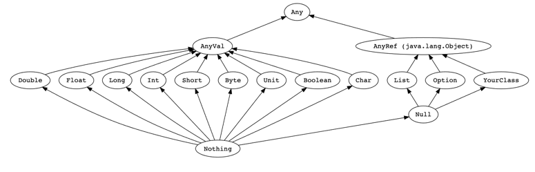
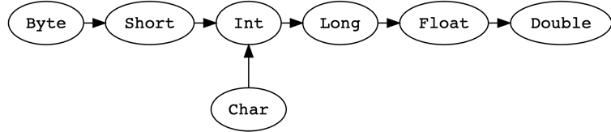

## 类图
所有的值都有类型，包括数值和函数。下图阐述了类型层次结构的一个子集。

## 类型转换
值类型可以按照下面的方向进行转换：

## scala数据类型

https://docs.scala-lang.org/zh-cn/tour/unified-types.html

```scala
  //类型转换
val x: Long = 987654321
val y: Float = x // 9.8765434E8 (note that some precision is lost in this case)
println(s"y=${y}")
val face: Char = '☺'
val number: Int = face // 9786
println(s"number=${number}")
//转换是单向，下面这样写将不会通过编译。
val a: Long = 987654321
val b: Float = a // 9.8765434E8
val c: Long = b // Does not conform
```
Nothing和Null
Nothing是所有类型的子类型，也称为底部类型。没有一个值是Nothing类型的。
它的用途之一是给出非正常终止的信号，如抛出异常、程序退出或者一个无限循环（
可以理解为它是一个不对值进行定义的表达式的类型，或者是一个不能正常返回的方法）。

Null是所有引用类型的子类型（即AnyRef的任意子类型）。它有一个单例值由关键字null所定义。
Null主要是使得Scala满足和其他JVM语言的互操作性，但是几乎不应该在Scala代码中使用。